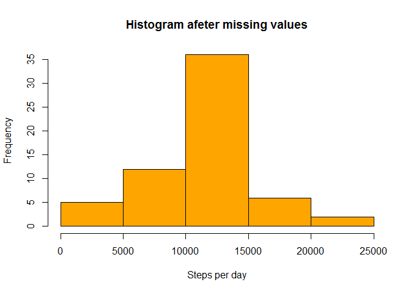

# Reproducible Research: Peer Assessment 1


## Loading and preprocessing the data


```r
library(lattice)
library(ggplot2)

setwd("C:\\Raphael\\estudos\\datasciencecoursera\\Reproducible Research\\Week2\\RepData_PeerAssessment1")
unzip("activity.zip")
activity_data = read.csv("activity.csv")
```


## What is mean total number of steps taken per day?


```r
mean_steps = aggregate(steps ~ date, data = activity_data, FUN = "sum")
par(mfcol=c(1,1))
hist(mean_steps$steps, main="Steps per day", xlab="Steps per day", col = "blue")
```

 

```r
mean(mean_steps$steps, na.rm=TRUE)
```

```
## [1] 10766.19
```

```r
median(mean_steps$steps, na.rm = TRUE)
```

```
## [1] 10765
```

## What is the average daily activity pattern?

```r
av_steps = aggregate(steps ~ interval, data = activity_data, FUN = "mean")

plot(av_steps$interval, av_steps$steps, type = "l", col = "blue", ylab = "steps",
     xlab = "interval")
```

 

```r
interval = av_steps$interval[which.max(av_steps$steps)]
```

The interval 835, on average, contains the maximum number of steps

## Imputing missing values

The total number of missing values is 2304

```r
sum(is.na(activity_data))
```

```
## [1] 2304
```

Replace Missing values (NAs) with average steps by 5-minute intervals

```r
steps_int <- aggregate(steps ~ interval, data = activity_data, FUN = mean)
activity_data <- merge(activity_data, steps_int, by = "interval", suffixes = c("", 
    ".y"))
nas <- is.na(activity_data$steps)
activity_data$steps[nas] <- activity_data$steps.y[nas]
activity_data <- activity_data[, c(1:3)]

steps_date <- aggregate(steps ~ date, data = activity_data, FUN = sum)
hist(steps_date$steps, xlab = "Steps per day", ylab = "Frequency", main = "Histogram afeter missing values",col = "orange")
```

 

```r
mean(steps_date$steps)
```

```
## [1] 10766.19
```

```r
median(steps_date$steps)
```

```
## [1] 10766.19
```


## Are there differences in activity patterns between weekdays and weekends?


```r
activity_data$date <- as.Date(activity_data$date)

daytype <- function(date) {
    if (weekdays(date) %in% c("sábado", "domingo")) {
        "weekends"
    } else {
        "weekdays"
    }
}

activity_data$daytype <- as.factor(sapply(activity_data$date, daytype))
```


```r
mean_activity_missing = aggregate(steps ~ interval + daytype, data=activity_data, FUN="mean")

xyplot(
    type="l",
    data=mean_activity_missing,
    steps ~ interval | daytype,
    xlab="Interval",
    ylab="Steps",
    col = "blue",
    layout=c(1,2)
)
```

 
